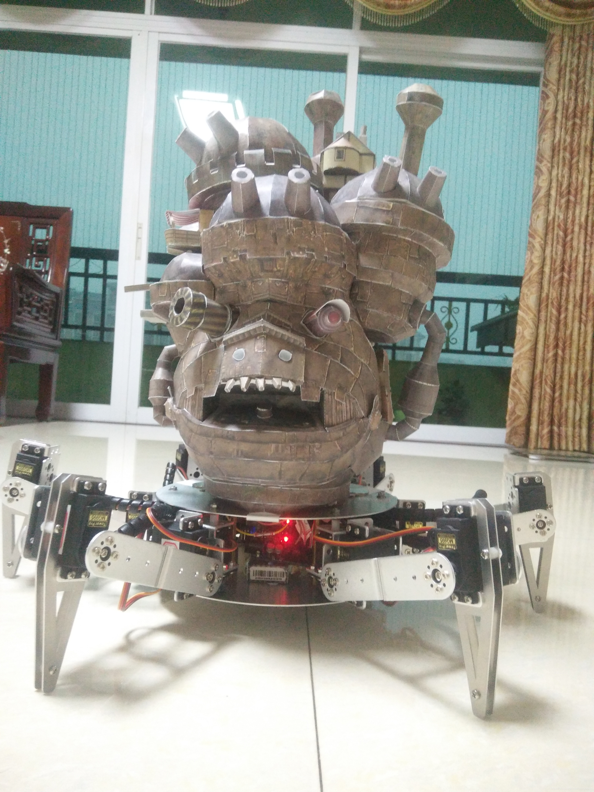

# Hexapod-Robot
这是一个六足机器人创客项目，以宫崎骏的电影《哈尔的移动城堡》作为灵感。由于资金非常有限，并且项目在家里完成，工具也非常有限，所以整个项目的设计思路是，保持机器人具有一定运载能力的同时，使用低成本硬件，并且尽量使用现成零件，减少加工需求。通过这个GitHub仓库，可以很方便地对整个项目进行复现，包括机械设计、电子设计以及程序设计，整个项目成本在1000块左右，如果你感兴趣的话，那就赶紧动起手来吧~

项目视频请移步 [bilibili](https://www.bilibili.com/video/av64897985/?from=search&seid=7617299682517278991&vd_source=153ba278958fdc1d3c65643050d045ed) 观看。

    

    

---

## 详细介绍 & 使用指南

请移步到我的 [CSDN 博客](https://blog.csdn.net/coolyabao/article/details/100145744) 查看吧。